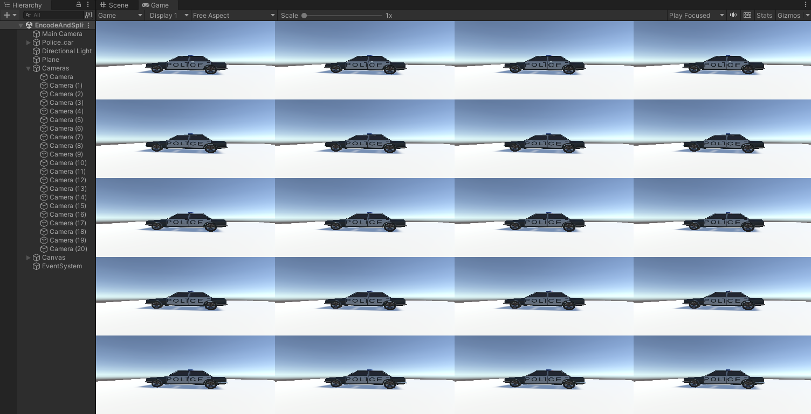
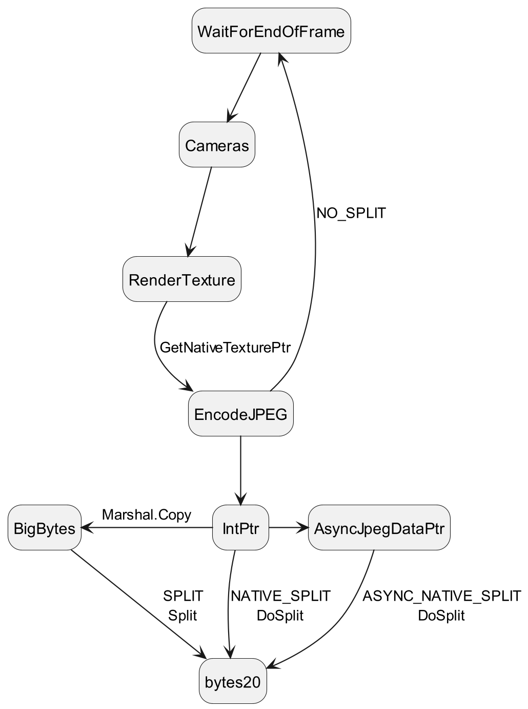
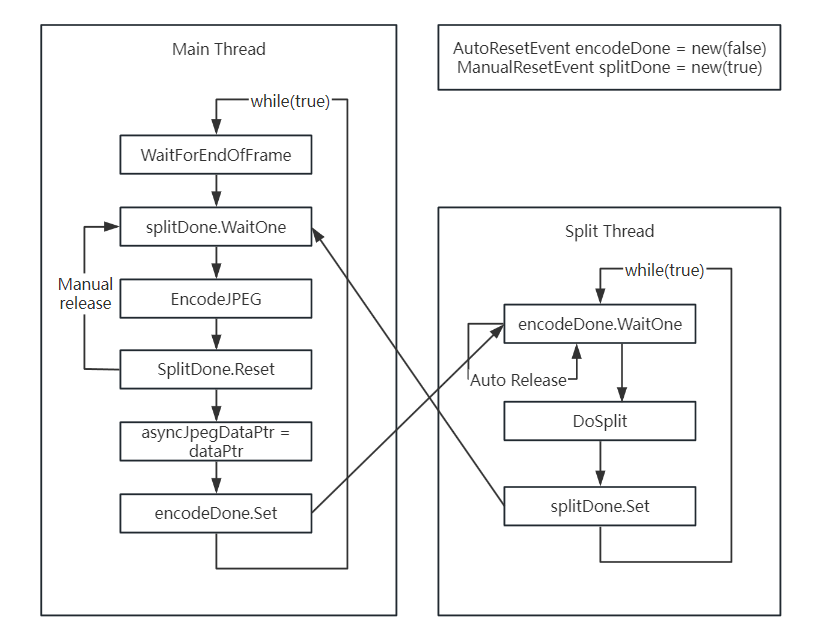

# JPEG Spliter
此库用于对**具备特定格式**的JPEG图像，在单线程以**极高的性能**进行分割（$O(n)$，其中n为JPEG文件的bytes数），是[该任务](https://gitee.com/sun-zhongjie-0426/unity-native-rendering-plugin-d3-d11-cuda)的**下游补充**，包括下述内容：
- [x] 【高性能】c实现与示例
- [x] c的对比测试
- [x] 【易于理解】python实现与示例
- [x] python的对比测试
- [x] 基于c的bytearray实现以及基本功能测试
- [x] python对bytes进行迭代的性能测试
- [x] 构建为DLL以供其他方法的引用
- [ ] 自动读取JPEG相关参数并进行验证
- [ ] 对JPEG各格式进行兼容性测试 
- [x] 更多实验数据
- [x] 更多语言版本的实现
## 开始使用
多种语言的实现均有示例，不依赖**基本库**外的任何内容，可直接使用。注意代码中**读写文件**不会影响耗时的计算。
- [./split_example.c]()
- [./split_example.py]()
- [./CSharp/SplitExample.cs]()

这些示例将根路径下的大图拆分到sub文件夹下。
### c
c语言版本的最简单示例，这一示例与[./split_example.c]()基本相同，此外，c版本示例中有**大量的注释**：
```c
#include"jpeg_spliter.c"
//read jpeg data to it
uint8_t *data;
size_t data_length;

// for a jpeg with 5120x3840
spliter_param param = {
    .single_width = 1280, 
    .single_height = 768, 
    .col = 4, 
    .row = 5, 
    .dri = 8, 
    .trim = false
    };

// set 20 pointer
byte_array *ba[20] = {0};

double cost=split(data,data_length,&param,ba);

fwrite(ba[0]->data,1,ba[0]->length,f);
```
### python
python版本的最简单示例就是[./split_example.py]()，没有必要再展开阐述了，不妨将代码拷贝到chatGPT，让chatGPT帮忙讲讲
### C#
C#版本的最简单示例也很简单，见[./CSharp/SplitExample.cs]()，建议让chatGPT进行阐述
## 参数设置
此节对用到的参数（spliter_param）进行介绍，部分参数需要对JPEG有一定的理解：
| 参数          | 类型 | 作用                                                                                                              |
| ------------- | ---- | ----------------------------------------------------------------------------------------------------------------- |
| single_width  | int  | 整张大图中，单张子图的宽度                                                                                        |
| single_height | int  | 整张大图中，单张子图的高度                                                                                        |
| col           | int  | 整张大图中，每行有几张子图                                                                                        |
| row           | int  | 整张大图中，每列有几张子图                                                                                        |
| dri           | int  | 这个参数是JPEG中DRI帧定义的内容，表明了对于图像数据中，RST标志之间有多少个MCU                                     |
| trim          | bool | 对于split函数分割后输出的bytearray，是否需要进行收缩以节省内存，建议禁用，从而以较少的额外空间换取更好的性能(10%) |

## 约束
本节阐述此库的约束；
1. 本库仅确认了在dri=8时可以正常运行
2. 本库仅确认了在三通道（YCrCb）分离存储（JPEG中有三个SOS帧）且每个通道所使用的MCU均为8x8时可以正常运行
3. 对于JPEG图像尺寸的要求：
   1. 大图的长、宽均为8的倍数
   2. 子图的长（width）为64的倍数（8*dri），宽为8的倍数
4. 本库主要针对GPUJPEG库的编码图像进行切分，在使用GPUJPEG编码本库所使用的测试图片时，遵循下述参数：
```c
	gpujpeg_set_default_parameters(&param);
	gpujpeg_image_set_default_parameters(&param_image);
	param_image.color_space = GPUJPEG_RGB;
	param_image.pixel_format = GPUJPEG_4444_U8_P0123;
```
5. 本库不保证JPEG信息的不丢失，并未遵循JPEG标准支持了应支持的帧
## 性能测试
本节对该库的基本性能进行测试，同样地，也探讨由于部分参数指定带来的性能影响。
### 测试图像
测试图像选取了前文的[那张大图](./unity_texture2d_big.jpg)，此外，项目中还包含一张[小一些的图](./unity_texture2d.jpg)可供开展测试。

此图的相关参数：
- 宽度：4*1280像素
- 高度：5*768像素
- 3通道分别编码
- 尺寸：约3822KB

采用的平台中，可能相关的项列举如下：
| 配置              | 参数                                          |
| ----------------- | --------------------------------------------- |
| CPU               | i7-12700                                      |
| MEM               | DDR4 64GB 2400MHz                             |
| OS                | Windows10                                     |
| C编译器（MSVC）   | cl 19.34.31937                                |
| C编译优化（MSVC） | /O2                                           |
| Python            | 3.11.7                                        |
| OS(Linux)         | Linux 5.4.0-177-generic(Ubuntu 20.04.6)       |
| C编译器(Linux)    | gcc 9.4.0                                     |
| C编译优化(Linux)  | gcc ljt_example.cpp -o ljt_example -ljpeg -O3 |
| C#IDE             | VisualStudio 2022                             |
| .Net              | .Net 6.0                                      |
| C#构建选项        | Release Any CPU                               |

分别运行下述的示例，这将会对一张内存中的jpeg执行200次切分操作，并且不包括文件读写时间，则测试结果如下：
| 实现                                   | 平均处理时长(ms) | FPS     | 备注                                                                                                 |
| -------------------------------------- | ---------------- | ------- | ---------------------------------------------------------------------------------------------------- |
| [c](./split_example.c)                 | 4.300            | 232.55  |                                                                                                      |
| c                                      | 6.204            | 161.18  | `trim=true`                                                                                          |
| c                                      | 4.211            | 237.45  | 将byte_array的扩容因子从默认的1.5改为2                                                               |
| c                                      | 4.822            | 207.37  | 将split函数中，对byte_array的初始化空间从JPEG尺寸的1/10改为1/20                                      |
| c                                      | 4.163            | 240.19  | 将split函数中，对byte_array的初始化空间从JPEG尺寸的1/10改为1（必定不会扩容）                         |
| c                                      | 5.128            | 195.00  | 对byte_array的初始化空间采用默认的10                                                                 |
| c([dll](./DLL/dll_example.c))          | 3.398            | 294.274 | 通过编译为dll再引用，在[DLL]()下执行nmake                                                            |
| c(dll)                                 | 4.733            | 211.296 | 通过编译为dll再引用，但每次处理时重新初始化`initSplitContext`                                        |
| c(SIMD256)                             | 5.256            | 190.26  | 采用SIMD指令集对FF查找进行加速的[实现版本](./jpeg_spliter_simd.c)，在cl中需开启AVX指令集`/arch:AVX2` |
| [C#](./CSharp/SplitExample.cs)         | 7.17             | 139.36  |                                                                                                      |
| [C# Bitmap](./CSharp/BitmapExample.cs) | 7110.57          | 0.14    | 需要在项目属性中将入口类改为BitmapExample;由于该方法过慢，因此`testTime=10`                          |
| [python](./split_example.py)           | 201.19           | 4.97    |                                                                                                      |
| [python opencv](./cv_example.py)       | 355.87           | 2.81    |                                                                                                      |
| [python pil](./pil_example.py)         | 422.7            | 2.36    |                                                                                                      |
| python pil                             | 184. 81          | 5.41    | 不执行`tile.save(BytesIO())`                                                                         |
| [bet](./byte_enum_test.py)             | 113.07           | 8.84    | 不做任何处理，仅枚举并读取图片中的每个byte，以阐述python实现的主要性能瓶颈                           |

此外，考察在Linux平台下的性能（因为可以直接下载可用的[libjpeg-turbo](https://libjpeg-turbo.org/)：`apt install libjpeg-turbo-dev8`）。尽管调用的头与连接的动态库均名为libjpeg，但实际其源码是libjpeg-turbo的实现。
| 实现                     | 平均处理时长(ms) | FPS    | 备注         |
| ------------------------ | ---------------- | ------ | ------------ |
| c                        | 2.849            | 351.01 |              |
| c                        | 5.216            | 191.73 | 不开启O3优化 |
| [ljt](./ljt_example.cpp) | 147.79           | 6.76   |              |
| [ljt](./ljt_example.cpp) | 147.66           | 6.77   | 不开启O3优化 |
### 总结
1. 在c语言版本中，主要的性能浮动来自于byte_array实现中，基于memcpy的扩容。小尺寸的扩容并不会带来过多的性能影响，然而在最后对于约300KB的数据采用memcpy扩容/收缩时，会带来较多的性能损失，因此本项目会将每个byte_array的初始尺寸约定为1/10的最大尺寸（分割为20张图的场景），该数值可以尽可能地避免扩容行为的发生。
2. 经测试，扩容因子是1.5（Java ArrayList）还是2（C++ vector）没有显著的性能影响，Java选取1.5主要来自于对JVM中减少内存碎片的考量。此外，1.5的实现已经通过位运算以避免实数运算。
3. python实现相对c存在约40倍的性能差距，尽管在实现上，均尽可能地采用了最优的方法，但通过在python中对bytes进行枚举测试可以发现性能开销基本来自对其的枚举。
4. PIL的实现中，实际上在将`tile.save(0)`去掉后，可以得到一个比python jpeg spliter更好的性能表现，然而在实际业务场景中，读取分割数据的期望下一步是将图片基于网络发送，因此不能够发送RGB格式的原始数据。
5. 在Linux平台开展的的测试中，是否开启O3对此项目影响很大，且性能远超Windows（完全相同的硬件平台），可能是Windows会将业务线程调到其他核心导致的。此外，基于libjpeg-turbo的实现性能仅比PIL略高。
6. C#版本的性能大概是同平台C版本的2/3，目前尚不清楚原因。但可观察到相比C版本，C#版本运行时CPU会有更多的内核态时间。
7. 观察到采用SIMD指令集后，反而性能衰减较多
## SIMD指令集版本
接上文，分析整个业务中，最为耗时的是对JPEG图片中的0xFF进行查找。由于大部分对字节的遍历均不会成立`b==0xFF`的逻辑，因此理论上进入子if的判断是少数情况。
因此，考虑引入并行指令集SIMD对0xFF查找优化，实现见[./jpeg_spliter_simd.c]()。

在上文测试中，观察到采用SIMD反而导致了更差的性能。因此构建测试用例，开展对遍历查找0xFF的性能测试：[./test/simd_find_benchmark.c]()

该测试中，通过读取一张JPEG图片，并采用二次增长法将其快速扩充至2048倍（约6GB数据），并分别使用朴素遍历、SIMD128、SIMD256进行查找测试，测试结果：

```
copying
copied
Native Method Usage: 6035
SIMD256 Method Usage: 7893
SIMD128 Method Usage: 5423
starting diff check
diff check passed
```

结果上，SIMD128仅比朴素方法快10%，而SIMD256则比朴素方法更慢。
实际上从1~2048的任何倍率测试均呈现此规律，并且需要说明的是大部分JPEG图片均远小于3MB。

该反直觉的测试结果的可能原因是在一张JPEG分布中，0xFF分布比主观理解更密集，这使得大部分的SIMD操作会进入`mask==1`，并进一步开始使用位运算仔细查询0xFF的位置。

为验证这一可能性，分别构造data=0xFF、data=0x00的两个用例：
| 方法    | 取值 | 时间(ms) | 倍率 |
| ------- | ---- | -------- | ---- |
| Native  | JPEG | 6147     | 2048 |
| SIMD256 | JPEG | 7994     | 2048 |
| SIMD128 | JPEG | 5470     | 2048 |
| Native  | 0x00 | 1816     | 2048 |
| SIMD256 | 0x00 | 334      | 2048 |
| SIMD128 | 0x00 | 377      | 2048 |
| Native  | 0xFF | 2603     | 2048 |
| SIMD256 | 0xFF | 3025     | 2048 |
| SIMD128 | 0xFF | 2125     | 2048 |

在这一验证中，显然可以观察到FF分布对结果的影响，且JPEG产生的随机分布产生的挑战是最大的，猜测这一分布可能导致了更频繁的分支预测失误。
## 集成测试
本节中，阐述将[上游任务](https://gitee.com/sun-zhongjie-0426/unity-native-rendering-plugin-d3-d11-cuda)与该任务整合起来进行Unity中业务构建的测试。
### 任务选取
在Unity中，有如下的内容：


一辆警车会缓慢地在场景中旋转，有20个同位置的Camera会将内容渲染到RenderTexture上。
该RenderTexture不但会显示到UI Camera上，还会传输给GPU渲染为JPEG。之后，这一JPEG会采用本库进行分割。流程如下：


对于分割方式，采取了如下四种实现：
- NO_SPLIT：不分割，仅编码
- SPLIT：基于C#实现的分割
- NATIVE_SPLIT：基于c编译的dll实现的分割
- ASYNC_NATIVE_SPLIT：基于c编译的dll实现的分割，但是尽可能地将分割任务交付给另一个线程异步执行

对于`ASYNC_NATIVE_SPLIT`，两线程间交互采用了两个信号量实现，逻辑如下图：

### 测试方法
- 针对四种方案，测试性能表现
- 在Unity Editor中，观察FPS、main thread、render thread指标
- 使用Unity Profiler（stand alone）观察业务耗时
- 利用任务管理器观察CPU消耗
- 编码整张图片尺寸：5200x2840，五行四列
### 测试结果
| 分割方式           | FPS  | Main Thread(ms) | Render Thread(ms) | Profiler Cost(ms) | delta(ms) | CPU(%) |
| ------------------ | ---- | --------------- | ----------------- | ----------------- | --------- | ------ |
| NO_SPLIT           | 90.6 | 11.3            | 9.2               | 6.48              | 0.00      | 19.4   |
| SPLIT              | 10.5 | 95.0            | 90.7              | 83.47             | 76.99     | 15.0   |
| NATIVE_SPLIT       | 58.5 | 17.1            | 14.8              | 11.02             | 4.54      | 19.7   |
| ASYNC_NATIVE_SPLIT | 75.7 | 13.2            | 11.2              | 8.47              | 2.09      | 20.0   |

上述结果中：
- `NO_SPLIT`作为基准测试，用于衡量整体性能
- `Main Thread(ms)`是Unity主线程单帧时间
- `Render Thread(ms)`是Unity渲染线程单帧时间
- `Profiler Cost(ms)`是Unity Profiler中，PlayerEndOfFrame函数的单帧执行时间，理论上等于GPUJPEG编码时间+JPEG分割时间
- `delta(ms)`是相较于基准测试，`Profiler Cost(ms)`额外花费的时间，理论上等于JPEG分割时间
- `CPU(%)`为任务管理器观察到的Unity Editor进程的CPU占比
### 测试总结
1. 观察到ASYNC_NATIVE_SPLIT能够最大程度地提升FPS，尽可能接近不分割场景的帧数，推测性能消耗在于信号量、锁带来的线程切换
2. [基于C#实现的SPLIT](./CSharp/JpegSpliter.cs)的表现最差，且与上文测试结果不符。推测原因是由于在上文测试采用的.Net环境与Unity中不同
3. 综上，利用异步的方法可将单帧开销控制在2ms内，最快地提供可用分割图。尽管额外创建了线程，但CPU总开销没有显著提升
## 原理
主要考虑了JPEG的结构，快速的将RST间的MCU分解到各个子图，并复用JPEG头信息，从而在不解码JPEG的情况下完成图片的分割。

*详细内容待补充……*

## byte_array
byte_array是基于c实现的一个简单的自动扩容的字节数组，主要是由于本人想用纯c实现但纯c里面没有std::vector导致的。

*详细内容待补充……*